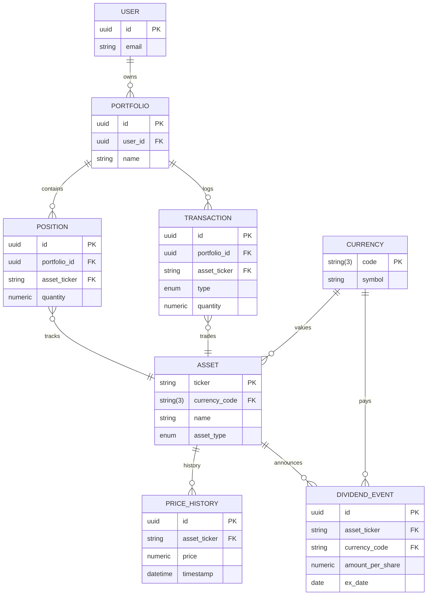

# Stakr Backend (FastAPI)

The Stakr backend is a FastAPI service that powers authentication and stack data.

- Runtime: **Python 3.12**
- Framework: **FastAPI**
- DB migrations: **Alembic**
- Tests: **pytest**

> Note: In this repository, production is split. The backend is deployed as an API.
> The backend can *also* serve a built frontend when `/app/static/index.html` is present (root Docker image build).

---

## Technical

## Project structure

```
backend/
  app/                  # FastAPI application
  alembic/              # Alembic migrations
  tests/                # Test suite
  requirements.txt      # Runtime dependencies
  dev-requirements.txt  # Dev tooling
  pyproject.toml        # Tooling config (black/isort/pytest)
  Dockerfile            # Backend-only image (legacy)
  entrypoint.sh         # Runs migrations (if DATABASE_URL set) then starts uvicorn
```

## Setup (Windows / PowerShell)

```powershell
# From repo root
py -3.12 -m venv .venv
. .\.venv\Scripts\Activate.ps1

python -m pip install --upgrade pip
python -m pip install -r backend\requirements.txt
python -m pip install -r backend\dev-requirements.txt
```

## Run the API (dev)

```powershell
# From repo root
python -m uvicorn app.main:app --app-dir backend --reload --port 8000
```

Useful endpoints:
- Health: http://127.0.0.1:8000/health
- Readiness: http://127.0.0.1:8000/ready
- OpenAPI / Swagger: http://127.0.0.1:8000/docs

## Tests

```powershell
cd backend
python -m pytest
```

## Lint & formatting

```powershell
python -m black backend
python -m isort backend
python -m flake8 backend
```

## Migrations (Alembic)

Alembic uses `DATABASE_URL`. Run these from `backend/` so it picks up `alembic.ini`.

```powershell
cd backend

# Generate a migration from model changes
python -m alembic revision --autogenerate -m "your message"

# Apply migrations
python -m alembic upgrade head
```

## Docker

### Recommended

Use the **root** `Dockerfile` (builds frontend + backend).
See `../README.md`.

### Backend-only (legacy)

```powershell
cd backend

docker build -t stakr-backend:local .
docker run --rm -p 8000:8000 --env-file .env.docker stakr-backend:local
```

> The container runs `entrypoint.sh` which runs migrations only when `DATABASE_URL` is set.

## CI/CD (automatic ACR push)

The GitHub Actions workflow builds and pushes the backend image to ACR when:
- a commit is pushed/merged to `main`, and
- something under `backend/` changed (or the root `Dockerfile` changed).

### Required GitHub secrets

- `ACR_LOGIN_SERVER` (example: `stakrregistry.azurecr.io`)
- `ACR_USERNAME`
- `ACR_PASSWORD`

### Image tags published

- `stakr-backend:sha-<full git sha>` (immutable)
- `stakr-backend:latest`

### Database Schema

