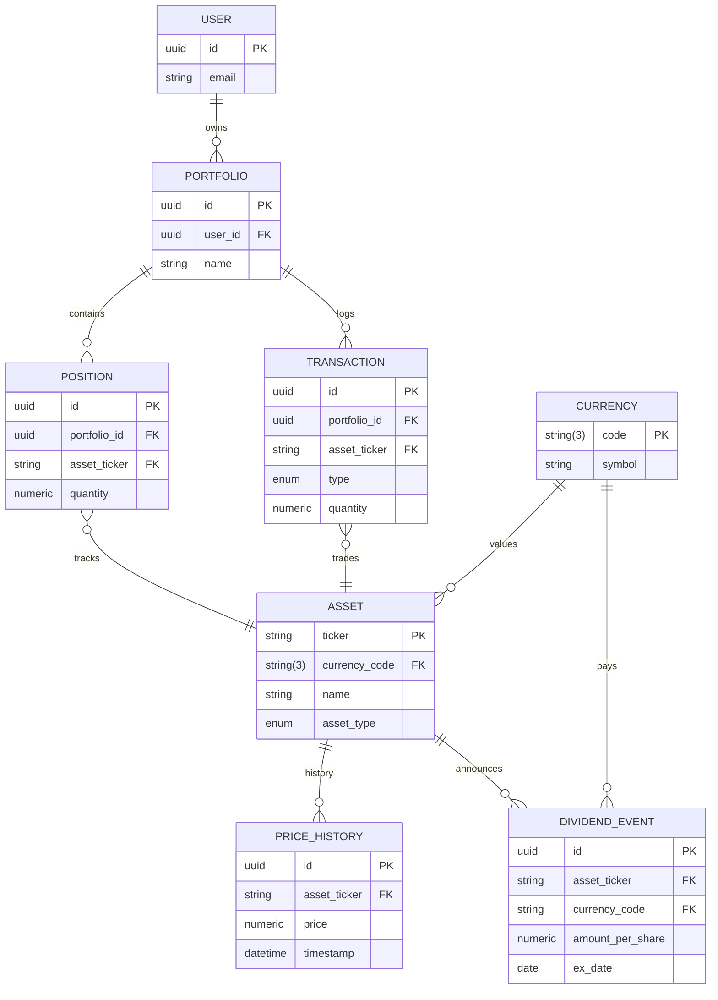

# Stakr Backend (FastAPI)

The Stakr backend is a FastAPI service that powers authentication and stack data.

- Runtime: **Python 3.12**
- Framework: **FastAPI**
- DB migrations: **Alembic**
- Tests: **pytest**

> Note: production is split. This service is deployed as an API only, to Azure
> Container Apps. The frontend is a separate Cloudflare Pages deployment.

---

## Technical

## Project structure

```
backend/
  app/                  # FastAPI application
  alembic/              # Alembic migrations
  tests/                # Test suite
  requirements.in       # Runtime dependencies (edit this)
  requirements.txt      # Generated lock: every version pinned and hashed
  dev-requirements.in   # Dev tooling (edit this)
  dev-requirements.txt  # Generated lock, covers runtime deps too
  pyproject.toml        # Tooling config (black/isort/pytest)
  Dockerfile            # Backend image
  entrypoint.sh         # Starts uvicorn (migrations only when RUN_MIGRATIONS=1)
```

## Dependencies

The `.txt` files are **generated locks** -- do not edit them by hand. Add or
change a dependency in the matching `.in` file, then recompile:

```powershell
# From repo root. Compiled in a Linux container so the resolution matches the
# runtime image; --universal keeps the lock installable on Windows too.
docker run --rm -v "${PWD}/backend:/w" -w /w python:3.12-slim `
  sh -c "pip install -q uv && uv pip compile requirements.in --universal --generate-hashes -o requirements.txt && uv pip compile dev-requirements.in --universal --generate-hashes -o dev-requirements.txt"
```

Installs are hash-verified (`--require-hashes`), so a swapped-out release on
PyPI fails the install rather than shipping.

## Setup (Windows / PowerShell)

```powershell
# From repo root
py -3.12 -m venv .venv
. .\.venv\Scripts\Activate.ps1

python -m pip install --upgrade pip
# The dev lock covers the runtime dependencies too, so this is the only install.
python -m pip install --require-hashes -r backend\dev-requirements.txt
```

## Run the API (dev)

```powershell
# From repo root
python -m uvicorn app.main:app --app-dir backend --reload --port 8000
```

Useful endpoints:
- Health: http://127.0.0.1:8000/health
- Readiness: http://127.0.0.1:8000/ready
- OpenAPI / Swagger: http://127.0.0.1:8000/docs

## Tests

```powershell
cd backend
python -m pytest
```

## Lint & formatting

```powershell
python -m black backend
python -m isort backend
python -m flake8 backend
```

## Migrations (Alembic)

Alembic uses `DATABASE_URL`. Run these from `backend/` so it picks up `alembic.ini`.

```powershell
cd backend

# Generate a migration from model changes
python -m alembic revision --autogenerate -m "your message"

# Apply migrations
python -m alembic upgrade head
```

## Docker

The image is backend-only. The frontend is deployed to Cloudflare Pages and is
not part of it.

```powershell
cd backend

docker build -t stakr-backend:local .
docker run --rm -p 8000:8000 --env-file .env.docker stakr-backend:local
```

> `entrypoint.sh` starts uvicorn. It applies migrations first only when
> `RUN_MIGRATIONS=1`; production applies them once per deploy instead, to keep
> Alembic off the container's cold-start path. Run
> `docker run ... stakr-backend:local migrate` to apply them and exit.

## CI/CD

`.github/workflows/backend-deploy.yml` runs on pushes to `main`/`master` that
touch `backend/**`, in three dependent jobs:

1. **build** -- builds the image and pushes it to GHCR
2. **migrate** -- runs Alembic once, as a Container Apps job
3. **deploy** -- rolls out a new revision, then smoke-tests `/health`

A failed migration stops the deploy, so a new image never serves traffic
against an old schema.

### Required GitHub secrets

| Secret | Purpose |
| ------ | ------- |
| `AZURE_CREDENTIALS` | Azure service principal for the CLI |
| `DATABASE_URL` | Passed to the migration job |
| `GHCR_PULL_TOKEN` | Classic PAT with `read:packages`, so Azure can pull the private image |

Pushing to GHCR uses the job-scoped `GITHUB_TOKEN`; only the pull side needs a
stored credential.

### Image tags published

`ghcr.io/<owner>/stakr-backend`, tagged:

- `sha-<full git sha>` (immutable, what gets deployed)
- `v<APP_VERSION>`
- `latest`
- `buildcache` (layer cache, not runnable)

### Database Schema


```mermaid
erDiagram
%% =========================
%% 1. Bloc utilisateur (gauche)
%% =========================
    USER ||--o{ PORTFOLIO: owns
%% =========================
%% 2. Pont central (alignement vertical)
%% POSITION au-dessus, TRANSACTION en dessous
%% =========================
    PORTFOLIO ||--o{ POSITION: contains
    POSITION }o--|| ASSET: tracks
    PORTFOLIO ||--o{ TRANSACTION: logs
    TRANSACTION }o--|| ASSET: trades
%% =========================
%% 3. Référentiel (droite)
%% =========================
    CURRENCY ||--o{ ASSET: values
    ASSET ||--o{ PRICE_HISTORY: history
    ASSET ||--o{ DIVIDEND_EVENT: announces
    CURRENCY ||--o{ DIVIDEND_EVENT: pays
%% =========================
%% ENTITIES
%% =========================
    USER {
        uuid id PK
        string email
    }

    PORTFOLIO {
        uuid id PK
        uuid user_id FK
        string name
    }

    POSITION {
        uuid id PK
        uuid portfolio_id FK
        string asset_ticker FK
        numeric quantity
    }

    TRANSACTION {
        uuid id PK
        uuid portfolio_id FK
        string asset_ticker FK
        enum type
        numeric quantity
    }

    ASSET {
        string ticker PK
        string(3) currency_code FK
        string name
        enum asset_type
    }

    PRICE_HISTORY {
        uuid id PK
        string asset_ticker FK
        numeric price
        datetime timestamp
    }

    DIVIDEND_EVENT {
        uuid id PK
        string asset_ticker FK
        string currency_code FK
        numeric amount_per_share
        date ex_date
    }

    CURRENCY {
        string(3) code PK
        string symbol
    }
```